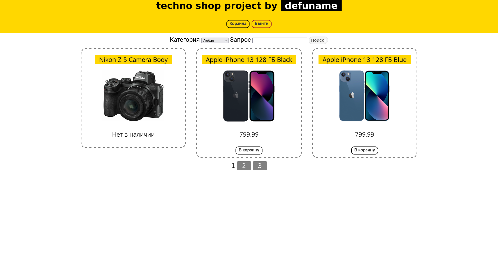
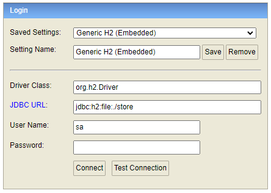
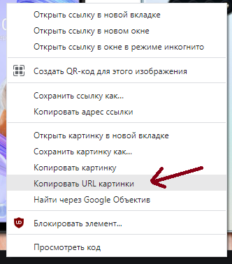
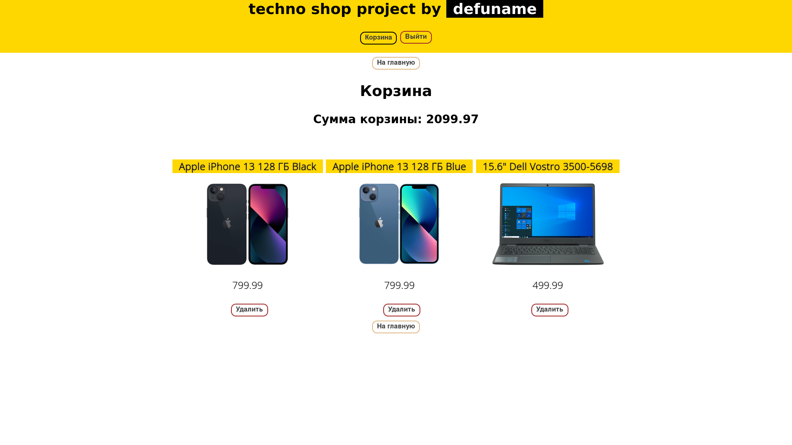
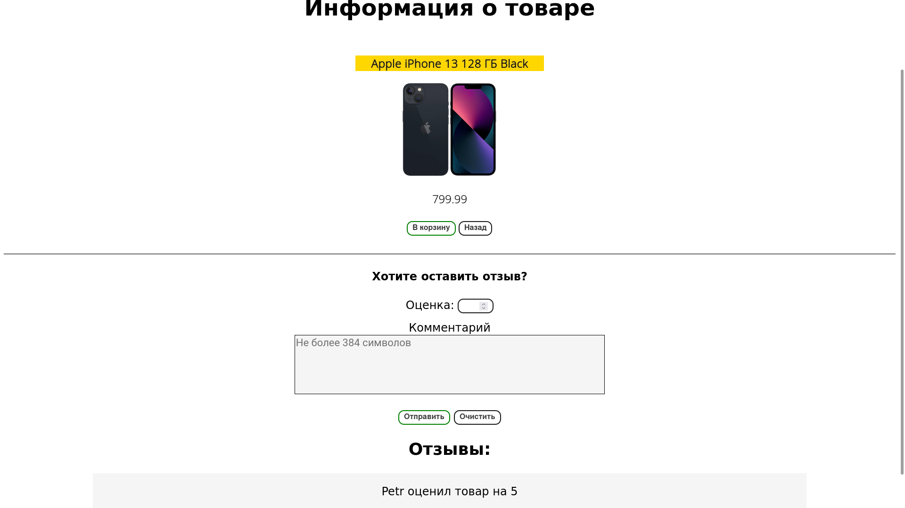
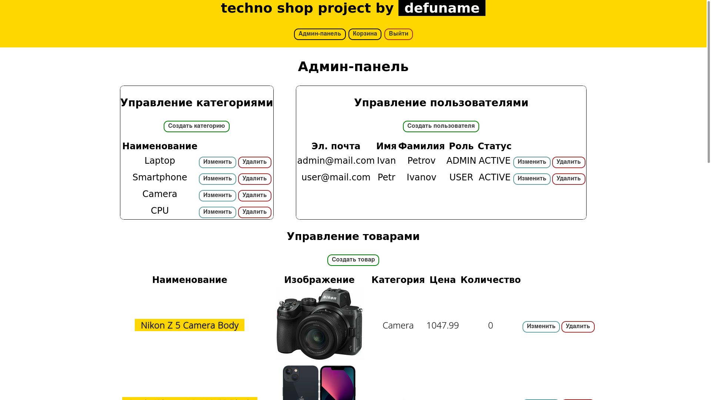
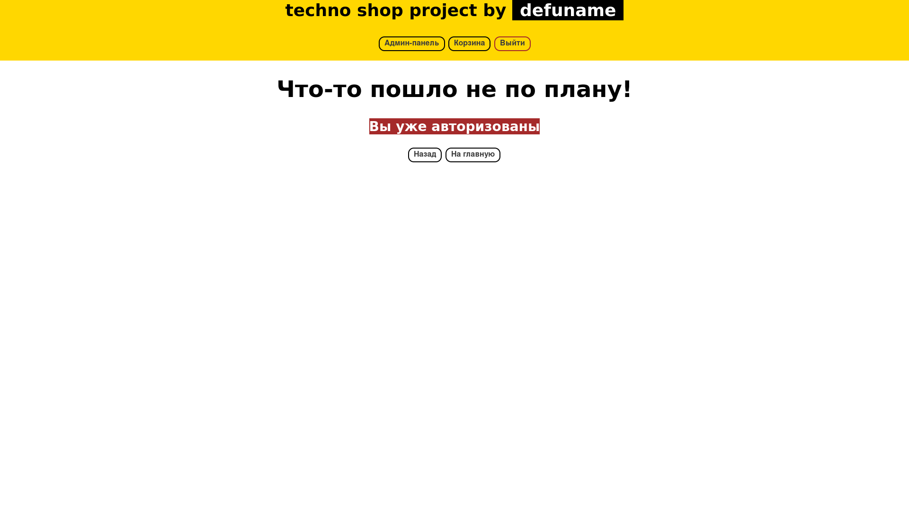

# It's a shop
✅ Реализация интернет-магазина на Spring
<p align="center">

<hr>

### Технологии
- Java 11 — основа
- Spring framework (Boot, MVC, Data JPA, Security) — фреймворк
- JUnit (Jupiter) + Mockito — тестирование
- H2 — БД *(in-memory mode)*
- Thymeleaf + CSS — фронт
## Установка
Клонируем репозиторий (и заходим в его корневой каталог):
```
$ git clone https://github.com/defaultuname/spring-boot-store.git
``` 
**Используя Maven**, пишем:
```
$ mvn clean install
```
**Запускаем:**
```
$ mvn spring-boot:run
```
#### Логин
Из коробки приложение уже имеет двух пользователей:
- `admin@mail.com` : `admin`, права `admin`
- `user@mail.com` : `user`, права `user`
### Уже реализовано
- [X] Товары: поиск, изменение, удаление, создание, просмотр. Разделение товаров по категориям
- [X] Корзина: удаление и добавление в корзину, общая стоимость
- [X] Отзывы (возможность оставить оценку и комментарий)
- [X] Секьюрити: бан, регистрация, авторизация, аутентификация, логаут, разделение прав на `user` и `admin`
- [X] Админ-панель: управление пользователями, товарами и их категориями
- [X] Пагинация
- [X] Стилизация
- [X] Error handling
- [X] Тесты & логгирование
### В планах
- Доработка Security
- Возможность лайкать/дизлайкать отзывы
- Процесс заказа + история заказов
- Описание товара
- Личный кабинет, возможность просматривать других пользователей
### И ещё кое-что
- Запуск происходит локально на порту `8080`
- Доступ к БД можно получить по URL `/h2-console`. Доступ имеют только авторизованные пользователи с правами `admin`  
- Данные для входа в БД:
    - URL: `jdbc:h2:mem:store`
    - Логин: `sa`  
    - Password:` `  (пароль пустой)  
  
- Картинки в БД хранятся в виде ссылок из интернета. Просто скопируйте ссылку на картинку и вставьте её при создании товара  
  
- **Все проблемы/баги приложения будут расписываться [здесь](https://github.com/defaultuname/spring-boot-store/issues)**
### Скриншоты
<p align="center">

<hr>
<p align="center">

<hr>
<p align="center">

<hr>
<p align="center">

<hr>
